# Continuous Integration

Continuous Integration (CI) is an essential part of software development.
It ensures that the codebase is always in a working state by running automated tests and checks on every change and pull request.
All tools within the Munich Quantum Toolkit (MQT) are developed with CI in mind, for which we use GitHub Actions.
The CI pipeline for MQT tools is designed to be modular and reusable, allowing us to share workflows across different projects and easily add new elements as needed.
{numref}`ci-flowchart` shows the CI pipeline for MQT tools, which includes workflows for C++ and Python projects, as well as CodeQL analysis, pre-commit checks, and documentation builds.

(ci-flowchart)=

```mermaid
---
zoom:
align: center
caption: Continuous Integration (CI) Pipeline for MQT Tools
alt: Flowchart of the CI pipeline for MQT tools.
---
flowchart LR
    start([start])
    subgraph ci ["Reusable Workflows"]
    S("🔍 Change / 🕵️ Check\n\nEntry point for reusable workflows.\nChecks which files changed.\nControls which workflows to run.")
    subgraph cpp ["C++ Workflows (only run for projects using C++)"]
    subgraph cpp-ubuntu [Runs C++ Tests on Ubuntu]
    direction LR
    cpp-ubuntu-debug("🇨‌ Test / 🐧 / Debug Mode")
    cpp-ubuntu-release("🇨‌ Test / 🐧 / Release Mode")
    cpp-ubuntu-debug ~~~ cpp-ubuntu-release
    end
    subgraph cpp-macos [Runs C++ Tests on macOS]
    direction LR
    cpp-macos-intel("🇨‌ Test / 🍎 macos-13 (x86)\nDebug and Release Mode.")
    cpp-macos-arm("🇨‌ Test / 🍎 macos-14 (arm64)\nDebug and Release Mode.")
    cpp-macos-intel ~~~ cpp-macos-arm
    end
    subgraph cpp-windows [Runs C++ Tests on Windows]
    direction LR
    cpp-windows-debug("🇨‌ Test / 🏁 / Debug Mode")
    cpp-windows-release("🇨‌ Test / 🏁 / Release Mode")
    cpp-windows-debug ~~~ cpp-windows-release
    end
    cpp-coverage("🇨‌ Test / 📈 Coverage\nCollects coverage from C++ tests on Ubuntu in Debug mode")
    cpp-linter("🇨 Lint / 🚨 Lint / Runs clang-tidy")
    end
    S --> cpp-ubuntu
    S --> cpp-macos
    S --> cpp-windows
    S --> cpp-coverage
    S --> cpp-linter

    subgraph python ["Python Workflows (assuming Python 3.8+ is supported)"]
    python-check("🐍 Test / 📦 Check\n\nBuilds and inspects the Python package.\nExtracts supported Python versions.")
    subgraph python-ubuntu [Runs Python Tests on Ubuntu]
    direction LR
    python-ubuntu-38("🐍 Test / 🐧 3.8")
    python-ubuntu-39("🐍 Test / 🐧 3.9")
    python-ubuntu-310("🐍 Test / 🐧 3.10")
    python-ubuntu-311("🐍 Test / 🐧 3.11")
    python-ubuntu-312("🐍 Test / 🐧 3.12")
    python-ubuntu-38 ~~~ python-ubuntu-39
    python-ubuntu-310 ~~~ python-ubuntu-311 ~~~ python-ubuntu-312
    end
    subgraph python-macos [Runs Python Tests on macOS]
    direction LR
    python-macos-intel-38("🐍 Test / 🍎 3.8 macos-13 (x86)")
    python-macos-intel-312("🐍 Test / 🍎 3.12 macos-13 (x86)")
    python-macos-arm-38("🐍 Test / 🍎 3.8 macos-14 (arm64)")
    python-macos-arm-312("🐍 Test / 🍎 3.12 macos-14 (arm64)")
    python-macos-intel-38 ~~~ python-macos-intel-312
    python-macos-arm-38 ~~~ python-macos-arm-312
    end
    subgraph python-windows [Runs Python Tests on Windows]
    direction LR
    python-windows-38("🐍 Test / 🏁 3.8")
    python-windows-312("🐍 Test / 🏁 3.12")
    python-windows-38 ~~~ python-windows-312
    end
    python-check --> python-ubuntu
    python-check --> python-macos
    python-check --> python-windows
    python-linter("🐍 Test / 🚨 Lint\nRuns mypy and check-sdist.")
    end
    S --> python-check
    S --> python-linter

    subgraph codeql [CodeQL Workflows]
    direction LR
    codeql-cpp("📝 CodeQL / 🇨++ Analysis")
    codeql-python("📝 CodeQL / 🐍 Analysis")
    codeql-cpp ~~~ codeql-python
    end
    S --> codeql

    check("🚦 Check\n\nChecks if all required checks succeeded.")
    cpp-ubuntu --> check
    cpp-macos --> check
    cpp-windows --> check
    cpp-coverage --> check
    cpp-linter --> check
    python-ubuntu --> check
    python-macos --> check
    python-windows --> check
    python-linter ---> check
    codeql --> check
    end
    pre-commit("🎨 pre-commit.ci\n\nRuns pre-commit on the PR changes.")
    rtd("📝 ReadTheDocs\n\nBuilds the documentation on RtD with a preview for PR builds.")
    release("🚀 Release Drafter\n\nAutolabels PRs and manages release drafts on commits to main.")

    start --> S
    start --> pre-commit
    start --> rtd
    start --> release
    check --> done(((done)))
    pre-commit -----> done
    rtd ----> done
    release ---> done
```



The following sections provide more details on the individual components of the CI pipeline.

## Reusable Workflows

The biggest component of the CI pipeline is the collection of reusable workflows to run tests and checks for C++ and Python projects.
To use these workflows in your project, you can include the following YAML file as `.github/workflows/ci.yml` in your repository depending on whether you have a mixed C++/Python project or a pure Python project.

::::{tab-set}

:::{tab-item} Mixed C++/Python Projects

```yaml
name: CI
on:
  push:
    branches:
      - main
  pull_request:
  merge_group:
  workflow_dispatch:

concurrency:
  group: ${{ github.workflow }}-${{ github.head_ref || github.run_id }}
  cancel-in-progress: true

jobs:
  change-detection:
    name: Change Detection
    uses: cda-tum/mqt/.github/workflows/reusable-change-detection.yml@v1.0.0

  cpp-tests:
    name: C++ Tests
    needs: change-detection
    if: fromJSON(needs.change-detection.outputs.run-cpp-tests)
    uses: cda-tum/mqt/.github/workflows/reusable-cpp-ci.yml@v1.0.0
    secrets:
      token: ${{ secrets.CODECOV_TOKEN }}

  cpp-linter:
    name: C++ Linter
    needs: change-detection
    if: fromJSON(needs.change-detection.outputs.run-cpp-linter)
    uses: cda-tum/mqt/.github/workflows/reusable-cpp-linter.yml@v1.0.0

  python-tests:
    name: Python Tests
    needs: change-detection
    if: fromJSON(needs.change-detection.outputs.run-python-tests)
    uses: cda-tum/mqt/.github/workflows/reusable-python-ci.yml@v1.0.0
    secrets:
      token: ${{ secrets.CODECOV_TOKEN }}

  code-ql:
    name: CodeQL
    needs: change-detection
    if: fromJSON(needs.change-detection.outputs.run-code-ql)
    uses: cda-tum/mqt/.github/workflows/reusable-code-ql.yml@v1.0.0

  required-checks-pass: # This job does nothing and is only used for branch protection
    name: Check
    if: always()
    needs:
      - change-detection
      - cpp-tests
      - cpp-linter
      - python-tests
      - code-ql
    runs-on: ubuntu-latest
    steps:
      - name: Decide whether the needed jobs succeeded or failed
        uses: re-actors/alls-green@release/v1
        with:
          allowed-skips: >-
            ${{
              fromJSON(needs.change-detection.outputs.run-cpp-tests)
              && '' || 'cpp-tests,'
            }}
            ${{
              fromJSON(needs.change-detection.outputs.run-cpp-linter)
              && '' || 'cpp-linter,'
            }}
            ${{
              fromJSON(needs.change-detection.outputs.run-python-tests)
              && '' || 'python-tests,'
            }}
            ${{
              fromJSON(needs.change-detection.outputs.run-code-ql)
              && '' || 'code-ql,'
            }}
          jobs: ${{ toJSON(needs) }}
```

:::

:::{tab-item} Pure Python Projects

```yaml
name: CI
on:
  push:
    branches:
      - main
  pull_request:
  merge_group:
  workflow_dispatch:

concurrency:
  group: ${{ github.workflow }}-${{ github.head_ref || github.run_id }}
  cancel-in-progress: true

jobs:
  change-detection:
    name: Change Detection
    uses: cda-tum/mqt/.github/workflows/reusable-change-detection.yml@v1.0.0

  python-tests:
    name: Python Tests
    needs: change-detection
    if: fromJSON(needs.change-detection.outputs.run-python-tests)
    uses: cda-tum/mqt/.github/workflows/reusable-python-ci.yml@v1.0.0
    secrets:
      token: ${{ secrets.CODECOV_TOKEN }}

  code-ql:
    name: CodeQL
    needs: change-detection
    if: fromJSON(needs.change-detection.outputs.run-code-ql)
    uses: cda-tum/mqt/.github/workflows/reusable-code-ql-python.yml@v1.0.0

  required-checks-pass: # This job does nothing and is only used for branch protection
    name: Check
    if: always()
    needs:
      - change-detection
      - python-tests
      - code-ql
    runs-on: ubuntu-latest
    steps:
      - name: Decide whether the needed jobs succeeded or failed
        uses: re-actors/alls-green@release/v1
        with:
          allowed-skips: >-
            ${{
              fromJSON(needs.change-detection.outputs.run-python-tests)
              && '' || 'python-tests,'
            }}
            ${{
              fromJSON(needs.change-detection.outputs.run-code-ql)
              && '' || 'code-ql,'
            }}
          jobs: ${{ toJSON(needs) }}
```

:::

::::

The workflows make some assumptions about the structure of your project, such as the location of the C++ and Python code, the presence of certain configuration files, and the use of the `CODECOV_TOKEN` secret for uploading coverage reports to [Codecov](https://codecov.io/).
Further details on the individual workflows are provided in the following.

### Change Detection

### C++ Workflows

### Python Workflows

### CodeQL Workflows

## Pre-commit Checks

## ReadTheDocs Builds

## Release Drafter
